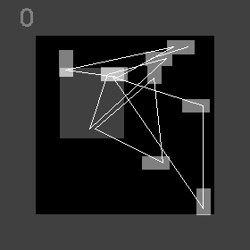
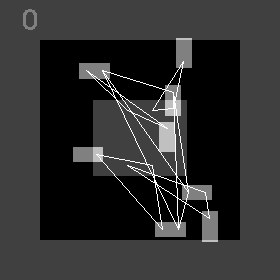
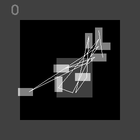
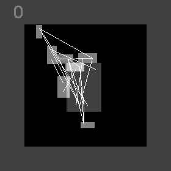

[toc]

RL\_PCB is a novel learning-based method for optimising the placement of circuit components on a Printed Circuit Board (PCB). It was developed for my Master's Thesis titled *Automated PCB component placement using Reinforcement Learning*, carried out under the supervision of Dr Josef Bajada. Reinforcement learning is used to learn general policies for iteratively improving a circuit placement, leading to intuitive layouts while outperforming stochastic methods in terms of post-routing wirelength.

The main contribution of this work is:
1. The policies learn the fundamental rules of the task and demonstrate an understanding of the problem dynamics. The agent is observed taking actions that **in the long term** minimise overlap-free wirelength. At the same time, the components naturally fall in place, resulting in a coherent layout. 
2. Since the agent represents a component, emergent behaviours are observed as a result of each component interacting with its neighbours. When we emphasise Half-Perimeter Wirelength (HPWL) in the reward function, we observe collaboration (e.g. Figure 1c, 1d); on the other hand, when we emphasise Euclidean Wirelength (EW), we observe competition (e.g. Figure 1b). 
3. The learned behaviour is robust because training data is diverse and consistent with the evaluative feedback assigned. Consistency is achieved by extensive normalisation and eliminating all potential sources introducing bias. Similarly goes for the reward. Diversity is obtained by allowing every agent to contribute to training samples with different perspectives which is further compounded by using multiple unique circuits for training - a relatively small training dataset of 6 circuits.

|     |     |     |
| --- | --- | --- |
|  <br />(a) (EW=0, HPWL=5, Overlap=5) |  <br />(b) (EW=8, HPWL=0, Overlap=2) |  <br />(c) (EW=0, HPWL=8, Overlap=2) |
|  <br />(d) (EW=0, HPWL=8, Overlap=2) |  <br />(e) (EW=8, HPWL=0, Overlap=2)|  <br />(f) (EW=8, HPWL=0, Overlap=2) |
|  <br />(g) (EW=8, HPWL=0, Overlap=2) |  <br />(h) (EW=2, HPWL=2, Overlap=6) |   <br />(i) (EW=2, HPWL=2, Overlap=6) |

**Figure 1**: Succesful policies optimising circuits not seen during training. 

# Installation Guide
**It is very important that the installation procedure is carried out while being in the root of the repository (i.e. the same location as the script install_tools_and_virtual_environment.sh)**

## Install Pre-requisites
The following packages must be installed on the system to compile libraries for parsing KiCAD PCB files (.kicad_pcb) and place-and-route tools.
```
sudo apt install build-essential libboost-dev libboost-filesystem-dev
```

To ensure consistency, Python code requires the use of version 3.8. Moreover, virtual environments for Python are necessary to install dependencies within a limited scope, preventing any modifications to the system's configuration. If Python3.8 is not available by default through the package manager of your system, you can use the following code to add an apt repository that maintains previous versions and source the required version accordingly.
```
sudo add-apt-repository ppa:deadsnakes/ppa -y
sudo apt update
sudo apt install python3.8 python3.8-venv
```

## Run automated installation script
The automated installation procedure makes the following changes to the local repository:
- Create a directory bin and installs the KiCad parsing utility, and place and route tools
- Creates an environment using python3.8, installs pytorch 1.13 with CUDA 11.7 and all necessary python packages
- Installs the wheel libraries in the lib folder

```
./install_tools_and_virtual_environment.sh
```

If you do not have CUDA 11.7 installed, you can install the CPU only. Tests an experiments will run significantly slower but works out of the box.
```
./install_tools_and_virtual_environment.sh --cpu_only
```

If you require a different version of CUDA, please make the following changes and run `install_tools_and_virtual_environment.sh` without any options:
- To `setup.sh` script, change the CUDA path to point to your installation of CUDA.
- To `install_tools_and_virtual_environment.sh` script, change the PyTorch libraries to use your CUDA version. 

Using a CPU device or alternative CUDA version will yield different results than the accompanying pdf reports for tests and experiments.

# Run tests and experiments
Always source the environment setup script before running any tests or experiments. **The script should be run from the root of the repository**
```
cd <path-to-rl_pcb>
source setup.sh 
```

Run an experiment
```
cd experiments/00_parameter_exeperiments
./run.sh    
```

Run a test - tests are used to validate the correct operation of the source code. They are periodically run in a Continuous Integration (CI) environment.
```
cd tests/01_training_td3_cpu
./run.sh
```

The script `run.sh` will perform the following: 
1. Carry out the training run(s) by following the instructions in `run_config.txt` that is located within the same directory
2. Generates an experiment report that processes the experimental data and presents the results in tables and figures. All experiment metadata is also reported, and customisation is possible through `report_config.py`, located within the same directory.
3. Evaluate all policies alongside simulated annealing baseline. All optimised placements are subsequently routed using an A\* based algorithm. 
4. Generate a report that processes all evaluation data and tabulates HPWL and routed wirelength metrics. All experiment metadata is also reported.

The generated files can be cleaned by running the following:
```
./clean.sh
```

Every test and experiment contains a directory called `expected results` that contains pre-generated reports. Should you run the experiments as provided, identical results are to be expected.

# GPU Setup (Optional)
This section provides an optional setup procedure to remove the Nvidia GPU driver and all dependent libraries and perform a fresh install. **The commands in this section make big changes to your system. Please read carefully before running commands** Some command changes will be required.

1. Remove CUDA if installed `sudo apt-get --purge remove cuda* *cublas* *cufft* *curand* *cusolver* *cusparse* *npp* *nvjpeg* *nsight*`
2. Check if the driver is installed, and if it is, remove it with `sudo apt-get --purge remove *nvidia*`
3. Remove cuddnn `sudo apt remove libcudnn* libcudnn*-dev`

### Install Nvidia GPU Driver
To install the driver, you can start by issuing the command `ubuntu-drivers` devices and identifying the latest third-party non-free version. Once you have identified the appropriate version, use `apt` to install the driver. After installing the driver, reboot your system and issue the command `nvidia-smi` to identify the full driver version. In the upcoming section, you will need this information to determine which CUDA version is supported.

### Download and install CUDA toolkit
To ensure that your device driver is compatible with CUDA, you'll need to check the compatibility using the following link: https://docs.nvidia.com/deploy/cuda-compatibility/. Once you've confirmed the compatibility, you can proceed to the CUDA Toolkit Archive at https://developer.nvidia.com/cuda-toolkit-archive. From there, select version 11.7 and choose the appropriate platform parameters from the "Select Target Platform" section. Next, download the runfile (local) and proceed with the installation process. Finally, follow the installation instructions carefully and avoid installing the driver when prompted.

```
wget https://developer.download.nvidia.com/compute/cuda/11.7.1/local_installers/cuda_11.7.1_515.65.01_linux.run
sudo sh cuda_11.7.1_515.65.01_linux.run
```

Update the setup.sh script as necessary. The default contents for `PATH` and `LD_LIBRARY_PATH` are:

```
export PATH="/usr/local/cuda-11.7/bin:$PATH"
export LD_LIBRARY_PATH="/usr/local/cuda-11.7/lib64:$LD_LIBRARY_PATH"
```

# This project is licensed under the terms of the MIT license
MIT License

Copyright (c) 2023 Luke Vassallo

Permission is hereby granted, free of charge, to any person obtaining a copy
of this software and associated documentation files (the "Software"), to deal
in the Software without restriction, including without limitation the rights
to use, copy, modify, merge, publish, distribute, sublicense, and/or sell
copies of the Software, and to permit persons to whom the Software is
furnished to do so, subject to the following conditions:

The above copyright notice and this permission notice shall be included in all
copies or substantial portions of the Software.

THE SOFTWARE IS PROVIDED "AS IS", WITHOUT WARRANTY OF ANY KIND, EXPRESS OR
IMPLIED, INCLUDING BUT NOT LIMITED TO THE WARRANTIES OF MERCHANTABILITY,
FITNESS FOR A PARTICULAR PURPOSE AND NONINFRINGEMENT. IN NO EVENT SHALL THE
AUTHORS OR COPYRIGHT HOLDERS BE LIABLE FOR ANY CLAIM, DAMAGES OR OTHER
LIABILITY, WHETHER IN AN ACTION OF CONTRACT, TORT OR OTHERWISE, ARISING FROM,
OUT OF OR IN CONNECTION WITH THE SOFTWARE OR THE USE OR OTHER DEALINGS IN THE
SOFTWARE.```
